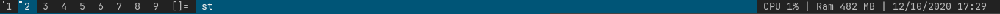

# dwm-bar
A minimal statusbar for dwm

## Installation
1. Clone and enter the repository:
```
$ git clone https://github.com/furvy04/dwm-bar.git
$ cd dwm-bar
```
2. Make the script executable
```
$ chmod +x dwm_bar.sh
```
## Quick Start
Simply run the script and dwm should display your bar:
```
$ ./dwm_bar.sh
```
# Statusbar
If you want dwm-bar to appear when X starts, add it to your .xinitrc file before starting dwm.
For example,if the script is located in / home / $ USER / dwm-bar /:
```
/home/$USER/dwm-bar/dwm_bar.sh &
```
